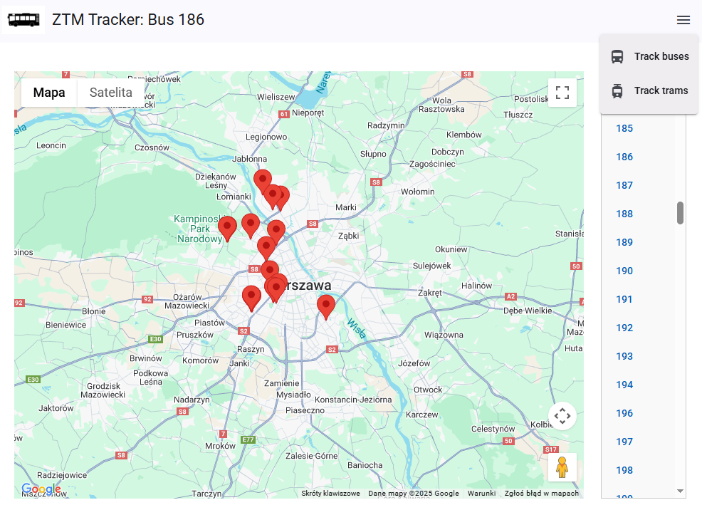

# ZtmMap

Project integrates the ZTM Warsaw api with google maps. It allows for live tracking of public transport.

Api provided by UM Warszawa: [api.um.warszawa.pl](https://api.um.warszawa.pl/)

## Setup

Place `Google maps api key` in [index.html](src/index.html) and `api um key` in [environment.ts](src/environments/environments.ts)

## Development server

After building run `ng serve --proxy-config proxy.conf.json` for a dev server. Navigate to `http://localhost:4200/`.
